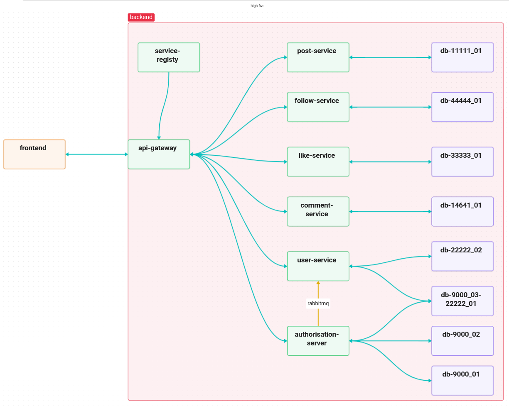

# HiV
> high-five


## links to repositories
- [high-five_frontend](https://github.com/singhalmradul/high-five_frontend)
- [high-five_service-registry](https://github.com/singhalmradul/high-five_service-registry)
- [high-five_api-gateway](https://github.com/singhalmradul/high-five_reverse-proxy)
- [high-five_authorisation-server](https://github.com/singhalmradul/high-five_authorisation-server)
- [high-five_user-service](https://github.com/singhalmradul/high-five_user-service)
- [high-five_post-service](https://github.com/singhalmradul/high-five_post-service)
- [high-five_like-service](https://github.com/singhalmradul/high-five_like-service)
- [high-five_comment-service](https://github.com/singhalmradul/high-five_comment-service)
- [high-five_follow-service](https://github.com/singhalmradul/high-five_follow-service)

## run backend
1. clone the above repositories such that the directories form this structure
    ```
    .
    └── high-five
        ├── high-five_authorisation-server
        ├── high-five_comment-service
        ├── high-five_follow-service
        ├── high-five_frontend
        ├── high-five_like-service
        ├── high-five_post-service
        ├── high-five_reverse-proxy
        ├── high-five_service-registry
        └── high-five_user-service

    ```
2. create `.env` file in `high-five` directory
3. create a cloudinary account at [Cloudinary](https://cloudinary.com/users/register_free)
4. create entry the following entry in `.env` file
    ```
    CLOUDINARY_URL=<couldinary-url>
    ```
    where `<cloudinary-url>` is the url provided to you by cloudinary
5. run the following command in `high-five` directory
    ```
    source ./backend-run.sh
    ```
## run frontend
1. create `.env` file in `high-five_frontend` directory
2. add the following entries to `.env` file
    ```
    REACT_APP_BACKEND_URL=http://localhost:8765
    REACT_APP_AUTH_AUTHORITY=http://localhost:9000
    REACT_APP_AUTH_CLIENT_ID=react
    REACT_APP_AUTH_REDIRECT_URI=http://localhost:3000/callback
    ```
3. run the following command in `high-five_frontend` directory
    ```
    npm install
    ```
4. run the following command in `high-five_frontend` directory
    ```
    npm start
    ```
## note:
- you need to have jdk >= 17 and docker installed along with docker compose plugin to be able to run backend
- you need to have node and npm installed to be able to run frontend
